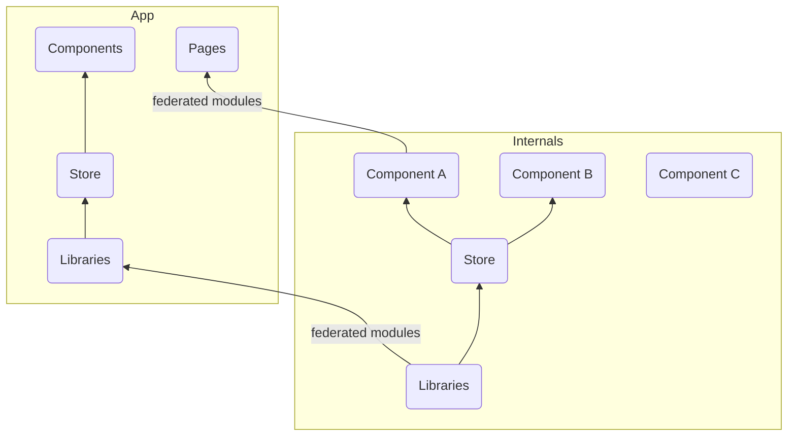
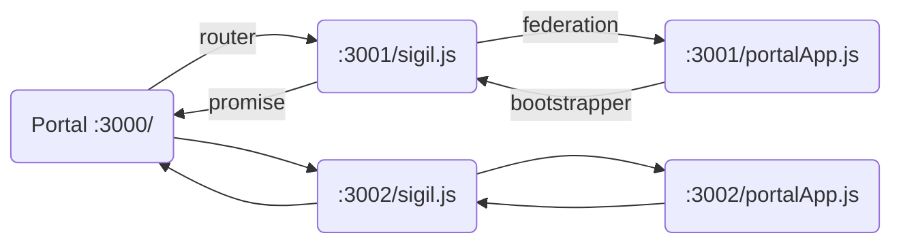

# Portal Federation

Portal for micro frontends using [Webpack Module Federation](https://webpack.js.org/concepts/module-federation/) and Single SPA

## Project Goals[<sup>0</sup>](https://webpack.js.org/concepts/module-federation/#concept-goals)

### Frameworks & Libraries

-   [React 18](https://reactjs.org/) - for rendering, context, local state, and lifecycle methods
-   [Redux](https://redux.js.org/) - for application state container
-   [Redux Toolkit](https://redux-toolkit.js.org/) - for better DX on asynchronous operation calls and communications
-   [React Router 6](https://reactrouterdotcom.fly.dev/) - for local routing between apps
-   [Semantic UI React](https://github.com/Semantic-Org/Semantic-UI-React) - user interface component library
-   [Webpack 5](https://webpack.js.org/) - asset bundler
-   [Express OIDC](https://auth0.github.io/express-openid-connect/) - login server
-   [MongoDB](https://github.com/oauthjs/express-oauth-server/tree/master/examples/mongodb) - user database
-   [Vite](https://vitejs.dev/) - web server
-   [Vercel](https://vercel.com) - edge deployment

### Use Cases

UC-1: As a user, I want to access the application from a single URL
UC-2: As a user, I need to have my own account
UC-3: As a user, I need to be able to access features that I am allowed to

### Requirements

R-1: Main entrypoint shall redirect to login screen (Express OIDC, e.g., http://localhost:3000)
R-2: [Main](https://webpack.js.org/concepts/module-federation/#separate-builds-per-page) application shall supply some form of global navigation (React, React Router 6)
R-3: Feature applications shall only be exposed to permitted users
R-4: Feature applications shall receive session information from Main application (Redux)

### Design Considerations

D-1: Feature applications may have their own internal router and sub pages
D-2: Feature applications should use the same shared UI components from a [container](https://webpack.js.org/concepts/module-federation/#components-library-as-container) (Semantic UI React)
D-3: Feature applications should consume a global state store (Redux)
D-4: Feature applications can provide their own local state store
D-5: Feature application runtimes and (non-shared) dependencies should be bundled (Webpack 5)
D-6: Shared Application dependencies should be federated (Webpack 5)
D-7: Feature applications shall be hosted separately in true distributed fashion (Vite)
D-8: Feature applications shall be configurable via YAML or JSON files
D-9: Configuration should be done at the time of deployment (Vercel)

## How it works

### Understanding Module Federation

The future of JavaScript is modules, right? An overwhelming majority of the community is in agreement that the standardization and improvements towards modules and lazy imports is headed in the right direction.[<sup>1</sup>](https://2021.stateofjs.com/en-US/opinions/#js_moving_in_right_direction) The ways of importing `<script>` tags and building runtime binaries locally are going to be left to a bygone era. Everyone wants in on the hip new asynchronous operation loading of remote modules via chunks. Users want to access their apps in the _cloud_ via single-sign-on (SSO). Developers want to create cooperatively and efficiently via code sharing. Deployment teams want to support scalability.

It all boils down to if it is feasible, productive, and profitable - at least from a business perspective. I want to do my part by being a professional frontend software engineer and dive into the scalability solutions offered by the Webpack team[<sup>2</sup>](https://webpack.js.org/concepts/module-federation/).

> **Module Federation** is an interface that allows a JavaScript application to dynamically load code from another application — in the process, sharing dependencies, if an application consuming a federated module does not have a dependency needed by the federated code — Webpack will download the missing dependency from that federated build origin.

That sounds awesome! Code can be shared, but fallbacks exist for each case, always prioritizing the federated code before attempting to request more. Less code duplication, less network traffic, better performance, happier users, happier devs.

Here's a simple visual:



#### Usage with Single-SPA

In traditional web applications, we serve the assets (HTML, CSS, JavaScript) to render. Now, with module federation we can separately serve our internals, like from a Design System library, and see updates near real-time in all consumer applications. Now, we may want multiple rendering libraries or multiple versions of applications being used in the same frontend. Not having that _would_ make it simpler.

To get different rendering frameworks together, like Vue and React, or React 16 and 18, we can leverage a library called [Single-SPA](https://single-spa.js.org/). Single-SPA relies on [SystemJS](https://github.com/systemjs/systemjs) to get the modules onto the DOM. Once the modules are loaded, they should all be using the same lifecycle methods. That won't necessarily work with Webpack 5's Module Federation, however we can _replace_ SystemJS with federated modules.

Here's how that might look:

```mermaid
graph BT
	subgraph Replace
		O(Orchestrator)
		O-->MF(Module Federation)
		S(SystemJS)-->T(-Bin-)
		P1(Parcel)
		P2(Parcel)
		P1-->O
		P2-->O
	end
	subgraph Application
		A1(Libraries)-->A2(Store)-->A3(Component A)
		A2-->A4(Component B)
		A5(Component C)
		A6(Single-SPA)
		MF-->A6
		PP(=Parcel=)
		A3-->PP
		A4-->PP
		A5-->PP
	end
```

The code for the Parcels moves back into the applications themselves.

### Understanding Module Federation (cont.)

These applications become:

> "...bi-directional hosts. Any application that's loaded first, becomes a host - as you change routes and move through an application, loading federated modules in the same way you would implement dynamic imports. However if you were to refresh the page, whatever application first starts on that load, becomes a host."[<sup>3</sup>](https://medium.com/swlh/webpack-5-module-federation-a-game-changer-to-javascript-architecture-bcdd30e02669)

Load the Landing page first? That's the host. Navigate from there to the About page? That's a remote. Refresh on the About? Now About is the host. The fetching between hosts and remotes only requires small portions of runtime code, not an entire entrypoint or entire application.

This host/remote debacle can be streamlined in architecture as treating a simple head entrypoint on top of an application. This main entrypoint connects all the other Webpack runtimes and provisions from the orchestration layer at runtime. It's not a normal app entrypoint; only a few KB. We'll call this simple package a **Sigil**. Sigils are our special entrypoints that will contain a special Webpack runtime that can interface with a host, we'll call a **Portal**.

### Terminology

#### Portal App (a remote)

A **Portal App** is a frontend application, built with Webpack, and will be consumed by the host. In order to be consumed, it must declare what it will expose. It can expose anything from lowest-level components like a particular Button to it's highest-level component like an Initializer. While there is support for bi-directional hosting, I don't see a point in using it from a more traditional app structure, so Portal Apps will not become a host - the user will only access the _main_ entry.

#### Sigil (an entry point)

A **Sigil**, as described above, will act as an entry to its corresponding Portal App. The goal is to have this be as small as possible to avoid network overhead, and provide _just enough_ configuration in order to allow the orchestration from Webpack to perform its operations.

#### Portal (a shell and host)

The **Portal** shell application is going to act as a host/hub for all downstream micro frontends to make up a full modular application. Built with Webpack, it will be initialized on the first page load.



### _Pseudo_ Code Blocks

Let's look at some code that demonstrates a remote app "_app_two_remote_" **exposing** a component called `Dialog`, that is going to be **consumed** in another remote app "_app_one_remote_".

```js
//app_one_remote/src/AppRouter.js
import * as React from 'react';
import { Route, Routes } from 'react-router-dom';
import Page1 from './pages/page1';
import Page2 from './pages/page2';

export default function AppRouter() {
	return (
		<Routes>
			<Route path='/page1' element={<Page1 />} />
			<Route path='/page2' element={<Page2 />} />
		</Routes>
	);
};
//--------------------------
//app_one_remote/src/App.js
import * as React from "react";
import AppRouter from './AppRouter'
const AppContainer = React.lazy(() => import("app_one_remote/AppContainer"));

export default function App() {
	return (
		<div>
			<React.Suspense fallback="Loading App Container from Host">
				<AppContainer routes={AppRouter}/>
			</React.Suspense>
		</div>
	);
}
```

#### Basic Configuration:

```js
//app_two_remote/webpack.config.js
const HtmlWebpackPlugin = require("html-webpack-plugin");
const ModuleFederationPlugin = require("webpack/lib/container/ModuleFederationPlugin");
module.exports = {
	plugins: [
		new ModuleFederationPlugin({
			name: "app_two_remote",
			library: { type: "var", name: "app_two_remote" },
			filename: "sigil.js",
			exposes: {
				“./Dialog”: "./src/Dialog"
			},
			remotes: {
				app_one: "app_one_remote", //Not necessary, but demonstrates bi-directional hosting
			},
			shared: ["react", "react-dom", "react-router-dom"]
		}),
		new HtmlWebpackPlugin({
			template: "./public/index.html",
			chunks: ["main"]
		})
	]
};
```

#### Basic Consumption:

```js
//app_one_remote/src/pages/Page1.js
const Dialog = React.lazy(() => import('app_two_remote/Dialog'));

export default function Page1() {
	return (
		<div>
			<h1>Page 1</h1>
			<React.Suspense fallback='Loading Material UI Dialog...'>
				<Dialog />
			</React.Suspense>
		</div>
	);
}
```

> There is little to no dependency duplication. Through the shared option — **remotes will depend on host dependencies, if the host does not have a dependency, the remote will download its own. No code duplication, but built-in redundancy.**[<sup>3</sup>](https://medium.com/swlh/webpack-5-module-federation-a-game-changer-to-javascript-architecture-bcdd30e02669)

### Deployed Independently

In a true distributed fashion, these micro-frontends should be deployed separately via their own webservers. Each webserver _can_ be on the same host IP, and different ports, or different IPs depending on the networking configuration (_blah blah insert CORS/Certs hand-waiving_).
