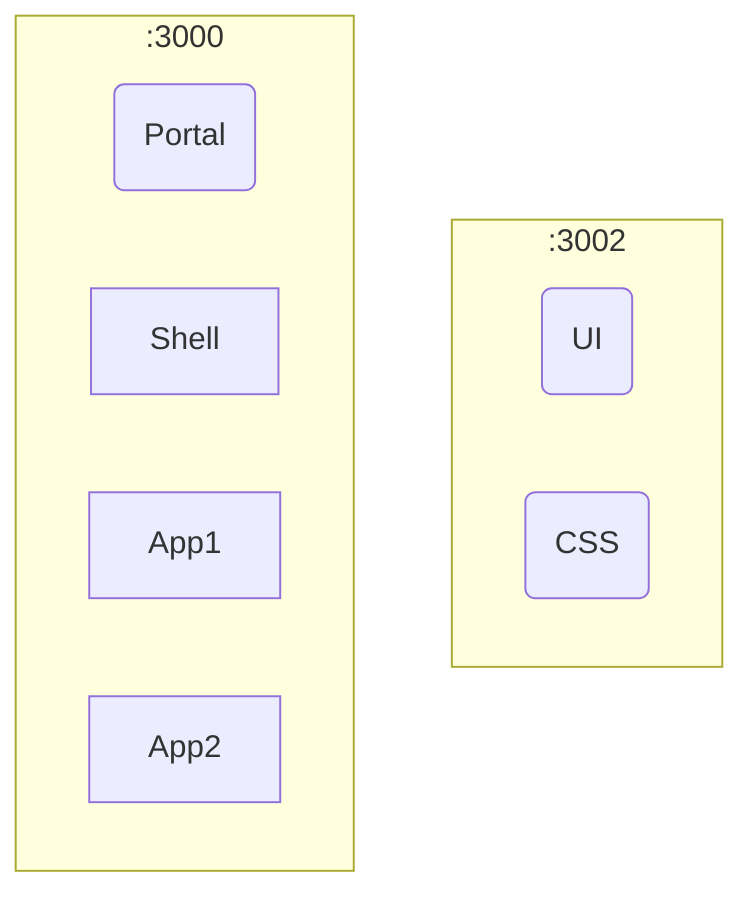
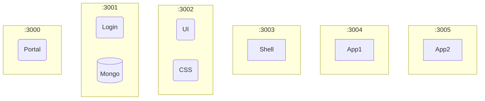

# Architecture

## Phase 1

Limited remotes



## Phase 2

Add remotes



## Phase 3

RD = Redux
MF = Module Federation

```mermaid
graph TD;
	subgraph Browser
		direction TB;
		U(-User-)
	end
	subgraph cluster1
		direction LR;
		subgraph Resources
			cfg(Configs)
		end
		subgraph podc1:3000;
			P(Portal)
			cfg-->P
		end
		subgraph podc1:3001;
			P--single-spa-->S(Shell)
			S-->Nav{Nav}
		end
		subgraph podc1:3002;
			App1
			Nav--router-->App1
		end
		subgraph podc1:3003;
			App2
			Nav--router-->App2
		end
		subgraph podc1:3004;
			App3
			Nav--router-->App3
		end
	end
	subgraph cluster2
		direction TB;
		subgraph podc2:3000;
			CSS([CSS])
			UI([UI])
		end
	end
	subgraph cluster3
		direction TB;
		subgraph podc3:3000;
			Login
		M[(Mongo)]
			U-->Login
			Login--OIDC-->P
		end
	end
```
